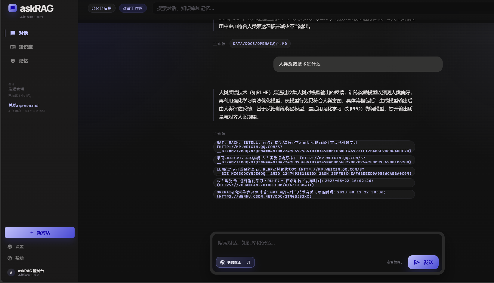
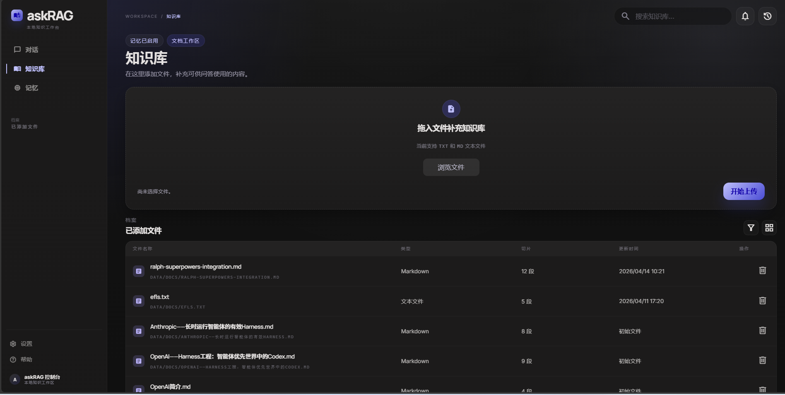
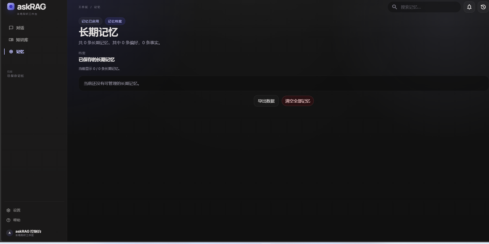
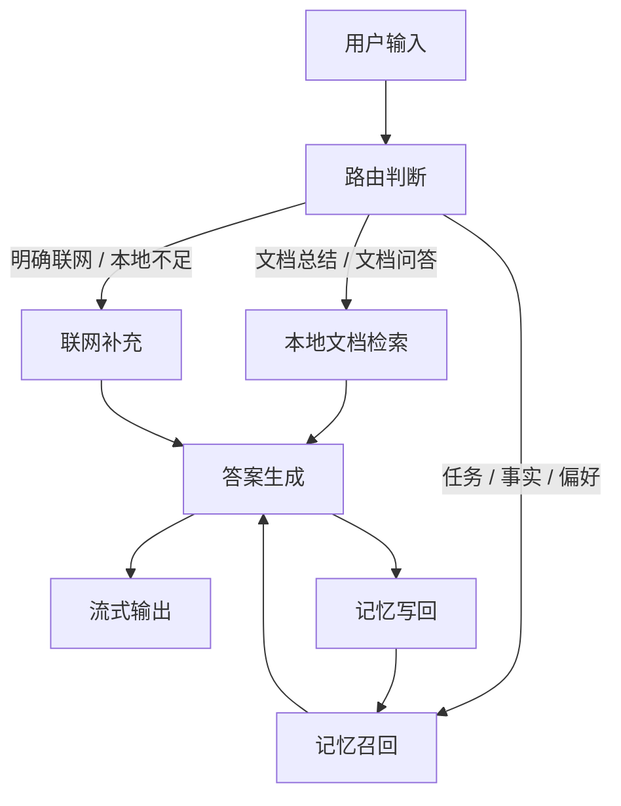

# askRAG

## 一句话描述

askRAG 把文档问答、任务记忆和可选联网放在同一条对话里，回答先依赖本地证据，再按需补充外部信息。


> 演示素材来自本地真实运行快照。

## 页面预览

| 首页 | 知识库 | 记忆页 |
| --- | --- | --- |
|  |  |  |

> 三个页面都来自本地真实运行快照。

## 架构图



## 核心设计决策

### 1. 文档和记忆分开，是为了让回答先有证据
文档回答看文件本身，记忆回答看用户的稳定状态。分开之后，系统才能判断一个问题是在查资料，还是在接着上次的任务继续聊。两者混在一起，最后只会让答案又慢又飘。

### 2. 先做便宜判断，是为了把耗时留给真正值得的请求
最常见、最明确的情况先分流，不让每个问题都压到完整检索和模型决策上。这样做不是为了“更聪明”，而是为了让对话更快、更稳。

### 3. 只保存会影响下一轮回答的内容
判断标准不是“说过没有”，而是“下一轮还用不用得上”。任务、事实、偏好优先保留；重复内容、噪音、临时信息不进长期层。记忆不筛选，只会越积越乱。

### 4. 主动写入和自动抽取分开，用户才知道自己存了什么
用户说“记住……”是明确写入；对话结束后的自动抽取更保守，也更容易回滚。两条路分开，系统才不会把“顺手整理”和“用户主动确认”混成一件事。

### 5. 删除要有边界，不能把长期事实一起误删
会话删掉后，相关的会话记忆应该一起清；但长期事实和偏好不能因为一条会话被误删。这个边界不说清楚，记忆越用越不可信。
## RFC 链接

- [RFC：项目总规划](PROJECT_PLAN.md)
- [RFC：当前执行计划](.project-loop/PLAN.md)
- [RFC：OpenViking 运行说明](openviking.md)

## 快速启动

### 1. 安装依赖

```powershell
.\.venv\Scripts\python.exe -m pip install -r requirements.txt
```

### 2. 构建或刷新本地索引

```powershell
.\.venv\Scripts\python.exe -m app.rag index
```

### 3. 启动服务

```powershell
.\.venv\Scripts\python.exe app\main.py
```

### 4. 打开页面

```text
Chat:    http://127.0.0.1:8001/
Library: http://127.0.0.1:8001/library
```

### 5. 如果要完整体验记忆，再启动 OpenViking

OpenViking 的本机启动说明在 [openviking.md](openviking.md)。  
如果你只想先看文档问答，本地索引和聊天页可以先单独跑起来。

## 一些当前边界

- 文档证据和记忆上下文是分开的。
- 记忆写回是可控的，不是把每轮对话都当成长期事实。
- 联网是补充，不是默认主路由。
- 如果你只需要先验证本地文档问答，不必先把所有记忆相关服务都准备好。
