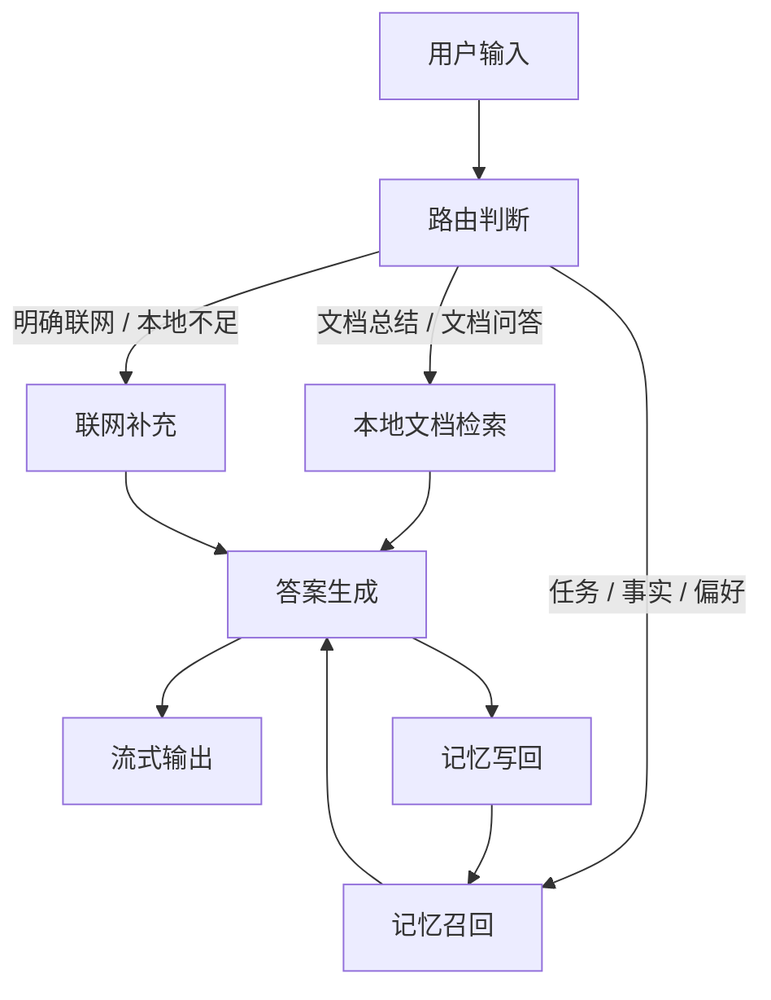

# askRAG

## 一句话描述

askRAG 是一个把文档问答、长期记忆和可选联网补充放在同一条对话里的知识工作台。


## 架构图



## 核心设计决策

### 1. 文档检索和记忆检索分开，是为了消除混淆而不是增加能力
文档回答依赖文件本身，记忆回答依赖用户的稳定状态。分开之后，系统才能判断一个问题是在查资料，还是在接着上次的任务继续聊。两者混在一起，反而什么都做不准。

### 2. 强规则先判，判不了再交给 LLM
不是每个问题都值得走完整流程。最常见、最明确的情况先用规则分流，避免每次都压 LLM 做决策。目的不是让系统更聪明，而是让对话更快、更稳定。

### 3. 只保存会影响下一轮回答的记忆
衡量标准是"这条记忆会不会改变下次的回答"，而不是"说过的都记下来"。任务、事实、偏好优先保留；重复内容、噪音、临时性信息不进入长期层。记忆不加筛选只会越积越乱。

### 4. 主动写入和自动抽取走不同的路
用户说"记住……"是一次明确的写入请求；对话结束后自动抽取的内容则更保守、更可回滚。两条路分开，用户才清楚什么是自己主动存的，什么是系统顺手整理的。

### 5. 删除有边界，清理可回退
会话删掉后，相关的会话记忆应该一起清；但长期事实和偏好不能因为一条会话被误删。这个边界不做清楚，记忆越用越不可信，用户最终会放弃用它。
## RFC 链接

- [RFC：项目总规划](PROJECT_PLAN.md)
- [RFC：当前执行计划](.project-loop/PLAN.md)
- [RFC：OpenViking 运行说明](openviking.md)

## 快速启动

### 1. 安装依赖

```powershell
.\.venv\Scripts\python.exe -m pip install -r requirements.txt
```

### 2. 构建或刷新本地索引

```powershell
.\.venv\Scripts\python.exe -m app.rag index
```

### 3. 启动服务

```powershell
.\.venv\Scripts\python.exe app\main.py
```

### 4. 打开页面

```text
Chat:    http://127.0.0.1:8001/
Library: http://127.0.0.1:8001/library
```

### 5. 如果要完整体验记忆，再启动 OpenViking

OpenViking 的本机启动说明在 [openviking.md](openviking.md)。  
如果你只想先看文档问答，本地索引和聊天页可以先单独跑起来。

## 一些当前边界

- 文档证据和记忆上下文是分开的。
- 记忆写回是可控的，不是把每轮对话都当成长期事实。
- 联网是补充，不是默认主路由。
- 如果你只需要先验证本地文档问答，不必先把所有记忆相关服务都准备好。
